<h1 align="center">
  <br>
</h1>

## Important
This Project is clone application Webtoon, create for add skills in React Native.</br>
if found a problem or error, I'm sorry for that

## Clone Webtoon
Clone Webtoon is project to Clone Application Webtoon Mobile, that same function for read or create a comic.  


## Screenshots

<p float="left">
  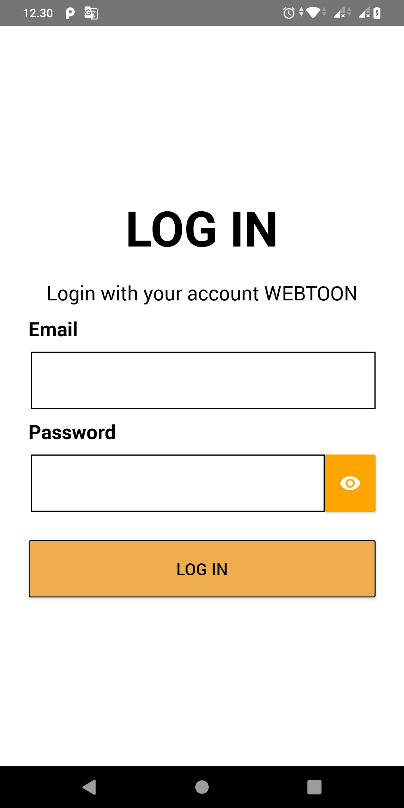
  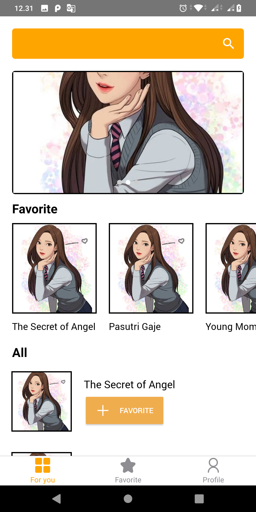
  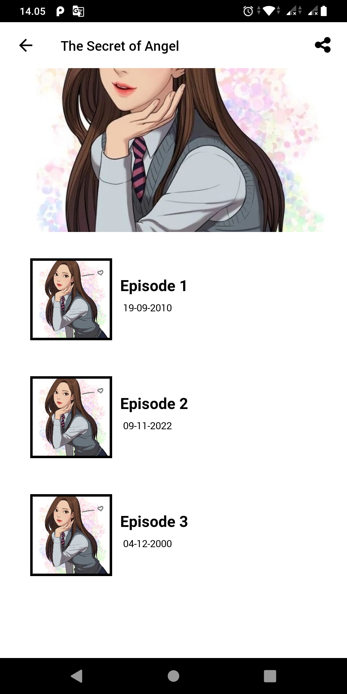
  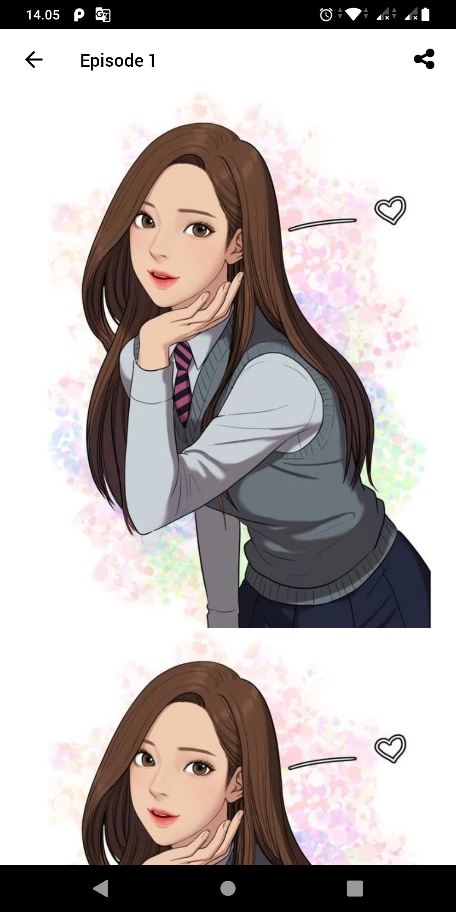
  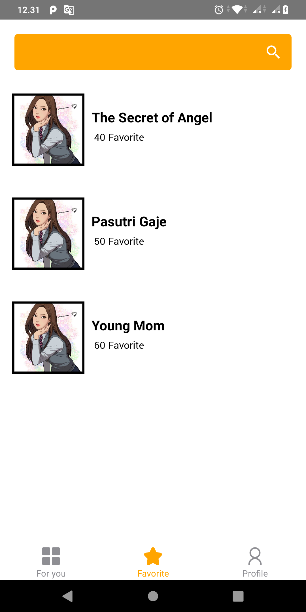
  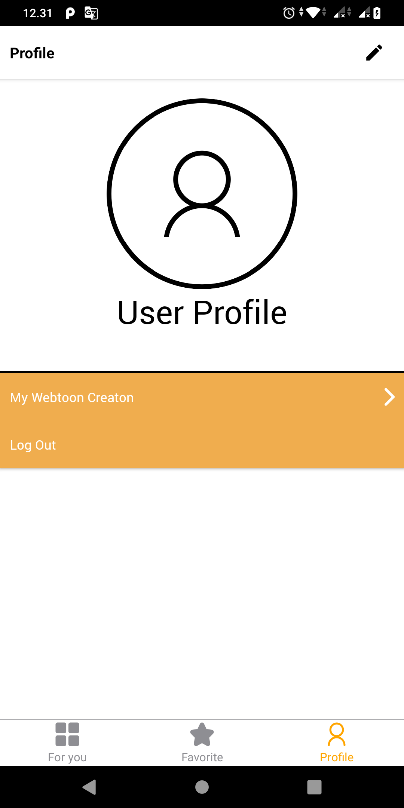
  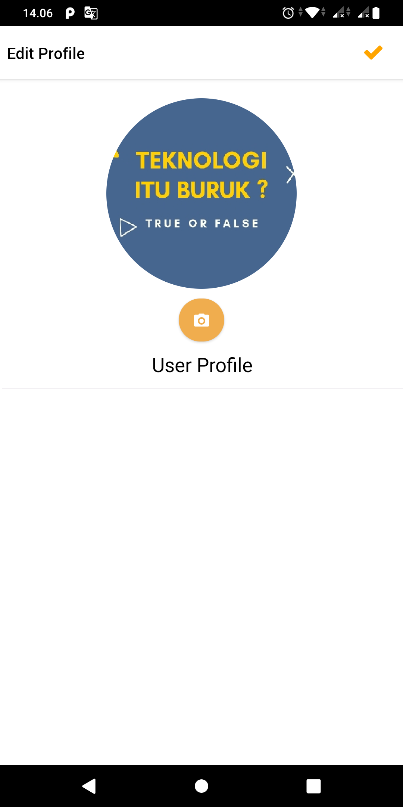
  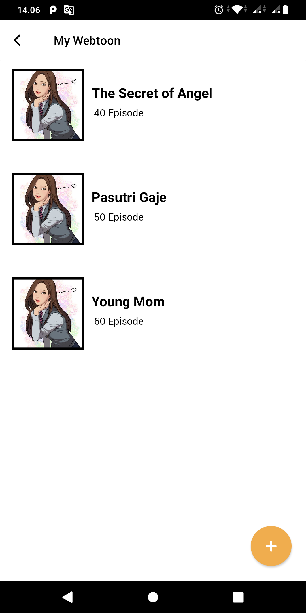
  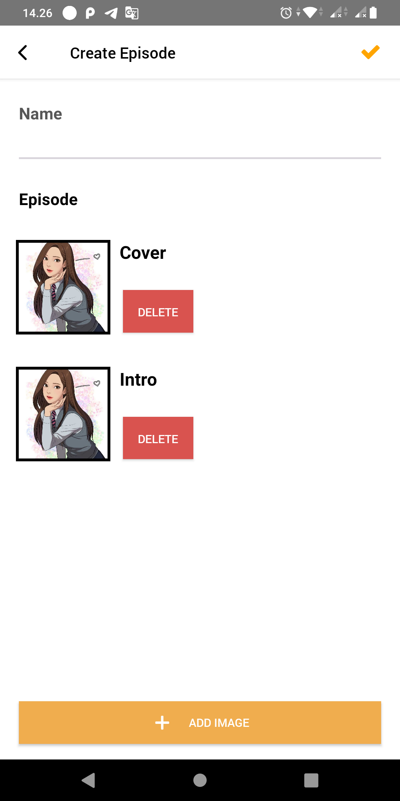
  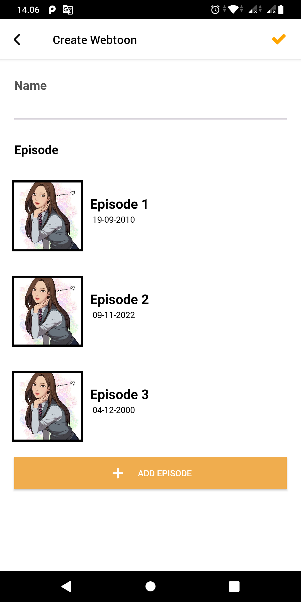
  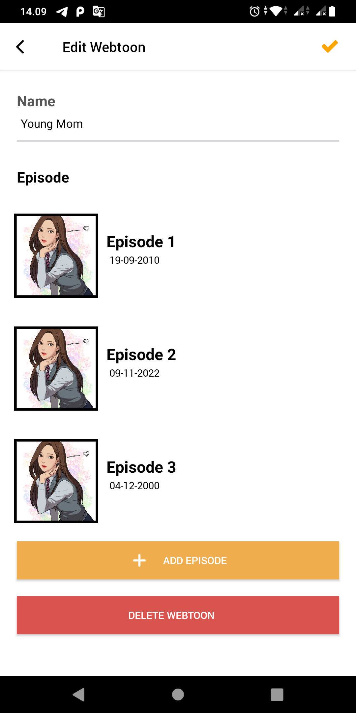
  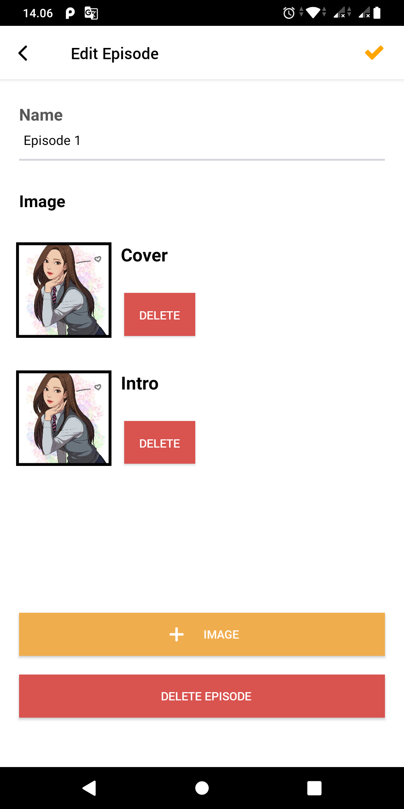
    
</p>


## Features
* Log In 
* Push your a comic
* Read a comic in mobile


## Tech Stack
* React Native for the Mobile Frontend

## Prerequisites
* Make sure You had been install NodeJs in your system https://nodejs.org/
* Then install React Native https://facebook.github.io/react-native/

## Installation & Configuration
Follow these step to install

**Frontend:**
```
$ git clone https://github.com/DumbWaysStudent/DW12LTSG3_webtoon
$ cd DW12LTSG3_webtoon
$ npm install
$ react-native run-ios #for ios
$ react-native run-android #for android
```
## Support Me :)
* Star this repository :star:
* Hire Me https://www.linkedin.com/in/dian-handiyansah-763aa9140/

## Contact 
* WA/TELEGRAM: +62 895 3546 36192
* email: dianhan8@gmail.com

* Thank You !